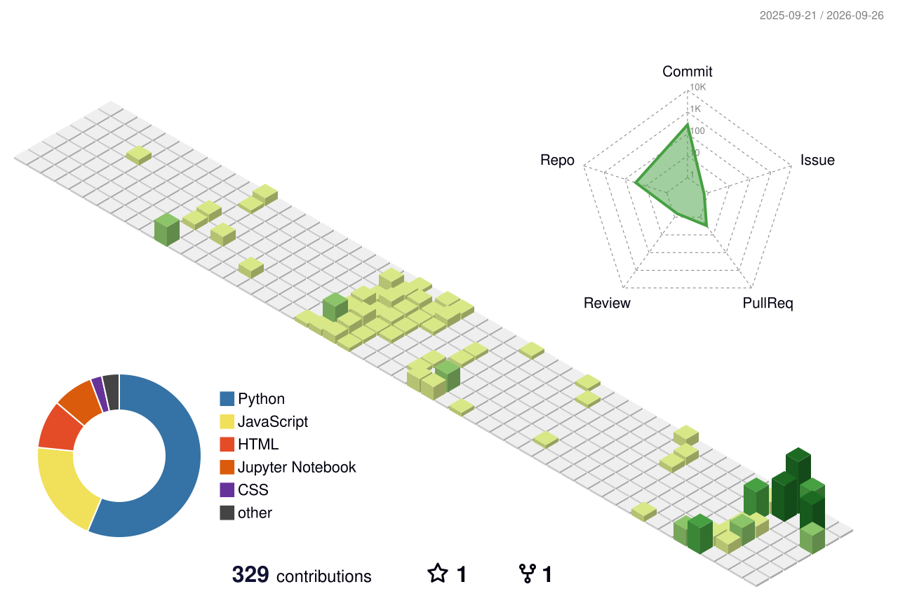

# 💫 About Me:
🔭 I’m currently working on: Pivoting my development focus toward  Operational Technology (OT) cybersecurity to protect critical industrial control systems.  👯 I’m looking to collaborate on: Security-focused  open-source projects involving Python scripting, network  segmentation, and defending SCADA and PLC environments.  🤝 I’m looking for help with: Mastering OT-specific threat detection  frameworks, industrial network architecture, and advanced  system design.  🌱 I’m currently learning: OT security protocols and vulnerability  management.  💬 Ask me about: PLC programming and industrial automation  using CODESYS or Python development.  ⚡ Fun fact:  I'm usually playing competitive timed matches  on Chess.com.

## 🌐 Socials:
   

# 💻 Tech Stack:
                           

<picture>
  <source media="(prefers-color-scheme: dark)" srcset="https://raw.githubusercontent.com/dev-innit/dev-innit/output/github-contribution-grid-snake-dark.svg" />
  <source media="(prefers-color-scheme: light)" srcset="https://raw.githubusercontent.com/dev-innit/dev-innit/output/github-contribution-grid-snake.svg" />
  
</picture>

   
    
# 📊 GitHub Stats:
 
 

## 🏆 GitHub Trophies

### ✍️ Random Dev Quote

---

<!-- Proudly created with GPRM ( https://gprm.itsvg.in ) -->
